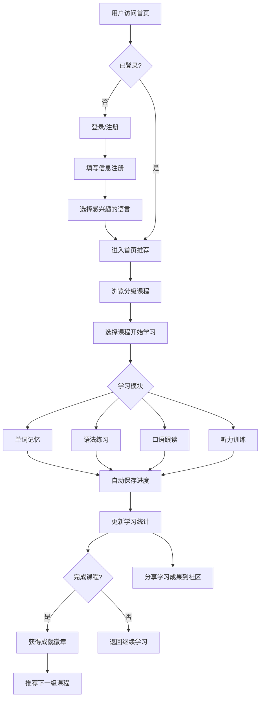

## 1. 产品概述

多语种学习在线教育平台，为语言学习者提供沉浸式学习体验，支持英语、日语、韩语等主流语言学习。通过分级课程体系、互动式学习模块和个性化推荐，帮助用户高效提升语言能力。

- 解决传统语言学习缺乏互动性、个性化和持续性追踪的问题
- 目标用户：语言学习者、学生、自学者、职场人士

## 2. 核心功能

### 2.1 用户角色

| 角色 | 注册方式 | 核心权限 |
|------|---------------------|------------------|
| 访客 | 无需注册 | 浏览首页、课程预览 |
| 注册用户 | 邮箱/用户名注册 | 完整学习功能、进度追踪、社区互动 |

### 2.2 功能模块

1. **首页**：语言选择、推荐课程、学习进度概览、导航栏
2. **认证页**：用户注册、登录
3. **课程列表页**：分级课程展示、筛选搜索
4. **学习页**：互动式学习模块（单词、语法、口语、听力）
5. **个人中心**：学习进度统计、成就展示、设置
6. **社区页**：学习分享、讨论交流

### 2.3 页面详情

| 页面名称 | 模块名称 | 功能描述 |
|-----------|-------------|---------------------|
| 首页 | Hero区域 | 平台介绍、语言选择入口、唤起用户学习热情 |
| 首页 | 推荐课程 | 根据用户历史推荐个性化课程、展示热门课程 |
| 首页 | 学习进度卡片 | 展示今日学习任务、连续学习天数、完成进度 |
| 认证页 | 登录表单 | 用户名/密码登录、支持第三方登录入口 |
| 认证页 | 注册表单 | 用户名、邮箱、密码、兴趣语言选择 |
| 课程列表页 | 分级筛选 | 按难度（初级/中级/高级）、语言类型筛选 |
| 课程列表页 | 课程卡片 | 展示课程封面、名称、难度、预计时长、完成率 |
| 学习页 | 单词记忆 | 卡片翻转记忆、四选一测验、拼写练习 |
| 学习页 | 语法练习 | 选择题填空、句子重组、错误解析 |
| 学习页 | 口语跟读 | 录音对比、发音评分、重复练习 |
| 学习页 | 听力训练 | 音频播放、听写填空、听力选择 |
| 学习页 | 进度保存 | 自动保存当前学习进度、支持随时退出继续 |
| 个人中心 | 进度追踪 | 学习时长统计、各语言掌握程度雷达图、课程完成曲线 |
| 个人中心 | 成就系统 | 展示获得徽章、学习里程碑、连续打卡记录 |
| 个人中心 | 个性化推荐 | 根据学习习惯生成推荐学习路径 |
| 社区页 | 动态分享 | 用户分享学习心得、打卡动态、点赞评论 |
| 社区页 | 话题讨论 | 按语言分类讨论区、提问解答 |

## 3. 核心流程

## 4. 用户界面设计

### 4.1 设计风格

- **主色调**：清新蓝色系 (#165DFF) 代表学习与信任，配合绿色 (#00B42A) 表示进步与完成
- **辅助色**：温暖橙色用于强调和号召性按钮，柔和紫色用于语言分类标识
- **字体**：Inter 作为主要字体，清晰易读；标题使用更有层次感的字重
- **布局**：卡片式设计，清晰的信息分区，左侧导航+主内容区
- **风格**：现代简约清新，偏向教育平台专业感，带有微妙的圆角和阴影增加层次感
- **图标**：线性图标为主，统一风格，重要成就使用填充徽章样式

### 4.2 页面设计概述

| 页面名称 | 模块名称 | UI元素 |
|-----------|-------------|-------------|
| 首页 | Hero区域 | 渐变色背景，大型标题，明亮CTA按钮，语言选择卡片网格 |
| 首页 | 进度概览 | 数据卡片，小型进度条，简洁数字展示 |
| 课程列表 | 课程卡片 | 圆角卡片，悬浮阴影效果，难度标签彩色标识 |
| 学习页 | 互动模块 | 大尺寸交互区域，清晰的操作按钮，即时反馈动画 |
| 个人中心 | 统计图表 | 雷达图展示能力分布，折线图展示学习趋势 |
| 个人中心 | 成就徽章 | 圆形/徽章样式，渐变背景，解锁态/锁定态区分 |

### 4.3 响应性

- 桌面优先设计，支持1200px+大屏展示
- 平板端自适应，调整为单栏布局
- 移动端优化，收起侧边导航为汉堡菜单，触控友好的按钮尺寸

### 4.4 颜色方案

- 背景：浅灰渐变 (#f5f7fa) 到白色，减少视觉疲劳
- 文本：深灰 (#1d2129) 主文本，中灰 (#4e5969) 次要文本
- 交互：点击/悬浮有明确的颜色变化和微动画
- 成功状态：绿色，错误状态：红色，提示：蓝色
