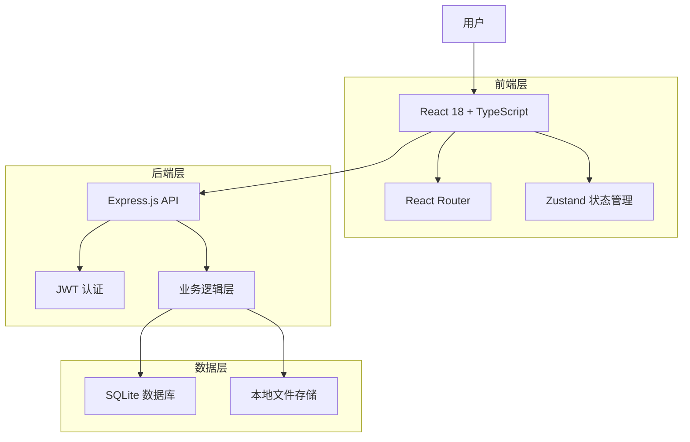
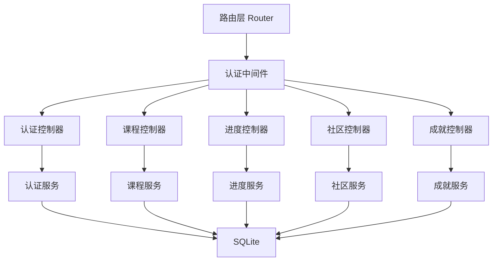
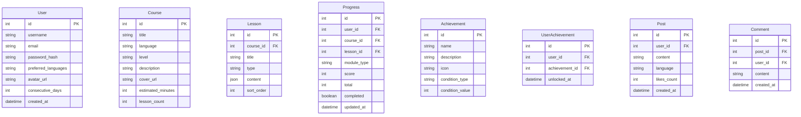

## 1. 架构设计



## 2. 技术描述

- **前端**: React 18 + TypeScript + Tailwind CSS + Vite
- **状态管理**: Zustand（轻量级状态管理）
- **路由**: React Router v6
- **后端**: Express.js + TypeScript
- **数据库**: SQLite（文件数据库，零配置）
- **认证**: JWT Token + bcrypt 密码哈希
- **初始化工具**: Vite（前端）+ ts-node（后端）
- **图表**: 自定义 CSS/SVG 实现统计图表

## 3. 路由定义

| 路由 | 用途 |
|-------|---------|
| / | 首页，语言选择和课程推荐 |
| /login | 用户登录页 |
| /register | 用户注册页 |
| /courses/:language | 按语言的课程列表页 |
| /learn/:courseId | 课程学习页（互动模块） |
| /profile | 个人中心（进度、成就、设置） |
| /community | 社区交流页 |

## 4. API 定义

```typescript
// 用户认证
POST /api/auth/register
Request: { username: string, email: string, password: string, languages: string[] }
Response: { token: string, user: User }

POST /api/auth/login
Request: { email: string, password: string }
Response: { token: string, user: User }

// 课程
GET /api/courses?language=string&level=string
Response: { courses: Course[] }

GET /api/courses/:id
Response: { course: CourseDetail }

// 学习进度
GET /api/progress
Response: { progress: UserProgress }

POST /api/progress/:courseId
Request: { module: string, score: number, completed: boolean }
Response: { progress: UserProgress }

// 成就
GET /api/achievements
Response: { achievements: Achievement[] }

// 社区
GET /api/community/posts?language=string
Response: { posts: Post[] }

POST /api/community/posts
Request: { content: string, language: string }
Response: { post: Post }

POST /api/community/posts/:id/like
Response: { likes: number }

POST /api/community/posts/:id/comments
Request: { content: string }
Response: { comment: Comment }

// 推荐
GET /api/recommendations
Response: { courses: Course[] }
```

## 5. 服务端架构图



## 6. 数据模型

### 6.1 数据模型定义



### 6.2 数据定义语言

```sql
CREATE TABLE users (
    id INTEGER PRIMARY KEY AUTOINCREMENT,
    username TEXT NOT NULL UNIQUE,
    email TEXT NOT NULL UNIQUE,
    password_hash TEXT NOT NULL,
    preferred_languages TEXT DEFAULT '[]',
    avatar_url TEXT DEFAULT '',
    consecutive_days INTEGER DEFAULT 0,
    last_checkin_date TEXT,
    created_at TEXT DEFAULT (datetime('now'))
);

CREATE TABLE courses (
    id INTEGER PRIMARY KEY AUTOINCREMENT,
    title TEXT NOT NULL,
    language TEXT NOT NULL,
    level TEXT NOT NULL,
    description TEXT DEFAULT '',
    cover_url TEXT DEFAULT '',
    estimated_minutes INTEGER DEFAULT 30,
    lesson_count INTEGER DEFAULT 10
);

CREATE TABLE lessons (
    id INTEGER PRIMARY KEY AUTOINCREMENT,
    course_id INTEGER NOT NULL,
    title TEXT NOT NULL,
    type TEXT NOT NULL,
    content TEXT DEFAULT '{}',
    sort_order INTEGER DEFAULT 0,
    FOREIGN KEY (course_id) REFERENCES courses(id) ON DELETE CASCADE
);

CREATE TABLE progress (
    id INTEGER PRIMARY KEY AUTOINCREMENT,
    user_id INTEGER NOT NULL,
    course_id INTEGER NOT NULL,
    lesson_id INTEGER NOT NULL,
    module_type TEXT NOT NULL,
    score INTEGER DEFAULT 0,
    total INTEGER DEFAULT 10,
    completed INTEGER DEFAULT 0,
    updated_at TEXT DEFAULT (datetime('now')),
    FOREIGN KEY (user_id) REFERENCES users(id) ON DELETE CASCADE,
    FOREIGN KEY (course_id) REFERENCES courses(id) ON DELETE CASCADE,
    FOREIGN KEY (lesson_id) REFERENCES lessons(id) ON DELETE CASCADE
);

CREATE TABLE achievements (
    id INTEGER PRIMARY KEY AUTOINCREMENT,
    name TEXT NOT NULL,
    description TEXT DEFAULT '',
    icon TEXT DEFAULT 'star',
    condition_type TEXT NOT NULL,
    condition_value INTEGER NOT NULL
);

CREATE TABLE user_achievements (
    id INTEGER PRIMARY KEY AUTOINCREMENT,
    user_id INTEGER NOT NULL,
    achievement_id INTEGER NOT NULL,
    unlocked_at TEXT DEFAULT (datetime('now')),
    FOREIGN KEY (user_id) REFERENCES users(id) ON DELETE CASCADE,
    FOREIGN KEY (achievement_id) REFERENCES achievements(id) ON DELETE CASCADE
);

CREATE TABLE posts (
    id INTEGER PRIMARY KEY AUTOINCREMENT,
    user_id INTEGER NOT NULL,
    content TEXT NOT NULL,
    language TEXT DEFAULT '',
    likes_count INTEGER DEFAULT 0,
    created_at TEXT DEFAULT (datetime('now')),
    FOREIGN KEY (user_id) REFERENCES users(id) ON DELETE CASCADE
);

CREATE TABLE comments (
    id INTEGER PRIMARY KEY AUTOINCREMENT,
    post_id INTEGER NOT NULL,
    user_id INTEGER NOT NULL,
    content TEXT NOT NULL,
    created_at TEXT DEFAULT (datetime('now')),
    FOREIGN KEY (post_id) REFERENCES posts(id) ON DELETE CASCADE,
    FOREIGN KEY (user_id) REFERENCES users(id) ON DELETE CASCADE
);

-- 初始成就数据
INSERT INTO achievements (name, description, icon, condition_type, condition_value) VALUES
('初次登录', '完成首次登录', 'login', 'login', 1),
('连续学习3天', '连续打卡学习3天', 'fire', 'consecutive_days', 3),
('连续学习7天', '连续打卡学习7天', 'fire', 'consecutive_days', 7),
('单词达人', '累计学习100个单词', 'book', 'word_count', 100),
('语法专家', '完成50道语法练习', 'grammar', 'grammar_count', 50),
('听力冠军', '完成30次听力训练', 'headphone', 'listening_count', 30),
('口语先锋', '完成20次口语练习', 'mic', 'speaking_count', 20),
('完成首门课程', '完成第一门完整课程', 'trophy', 'course_complete', 1),
('社区活跃', '发布10条社区动态', 'community', 'post_count', 10),
('坚持王者', '连续学习30天', 'crown', 'consecutive_days', 30);
```